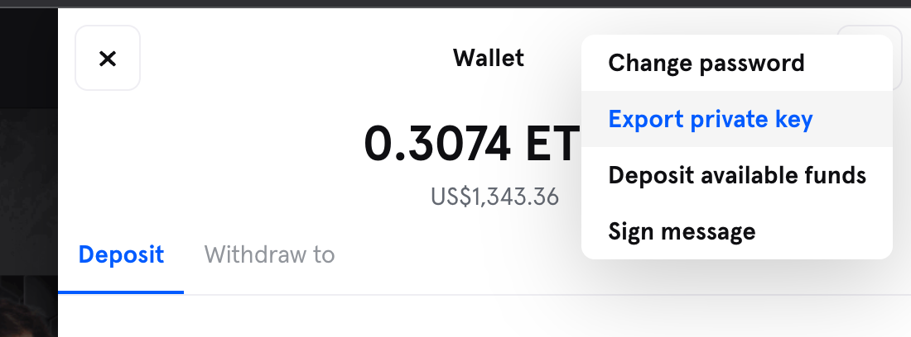

# API

We are committed to providing an open platform for developers to build upon.

While the Cards themselves are stored on the Ethereum blockchain (or in the Starkware rollup) we support an API that provides more detailed information.

The Sorare API is provided by [GraphQL](https://graphql.org/). Documentation can be found under the Docs section in the [GraphQL playground](https://api.sorare.com/graphql/playground).

## Authentication

### Pre-requisites

Before being authenticated with an `Authorization` HTTP header, all requests performed against our GraphQL API need:

- a valid `_sorare_session_id` HTTP cookie that you'll need to pass to all future API requests
- a valid `csrf-token` that you'll need to pass as a `x-csrf-token` HTTP header to all future API requests

While using our [GraphQL playground](https://api.sorare.com/graphql/playground), the `_sorare_session_id`, the `x-csrf-token` are set automatically by the playground and your browser.

Please also make sure to set the `content-type` HTTP header to `application/json`.

To authenticate yourself programmatically through our GraphQL API you'll need:

- your email
- the **hashed version** of your password

Your **password needs to be hashed** client-side using a salt. The salt can be retrieved alongside the `_sorare_session_id` and `csrf-token` with a HTTP GET request against our `https://api.sorare.com/api/v1/users/<youremail>` endpoint:

**Example:**

```bash
$ curl -i https://api.sorare.com/api/v1/users/myemail@mydomain.com

[...]
csrf-token: Rd1eqXQfPJduNjoq [...] <<= the `x-csrf-token` value can be retrieved here
set-cookie: _sorare_session_id=az%2FCsH%2BRcO%2B[...]; domain=.sorare.com; path=/; secure; HttpOnly; SameSite=None <== the `_sorare_session_id` cookie value can be retrieved here
[...]

{"salt":"$2a$11$SSOPxn....."}
```

The hashed password must be computed with _bcrypt_:

**Example in JavaScript:**

```javascript
import bcrypt from "bcryptjs";

const hashedPassword = bcrypt.hashSync(password, salt);
```

**Example in Ruby:**

```ruby
require "bcrypt"

hashed_password = BCrypt::Engine.hash_secret(password, salt)
```

### GraphQL `signIn` mutation

A GraphQL mutation is available for authentication: `signIn`.

```gql
mutation SignInMutation($input: signInInput!) {
  signIn(input: $input) {
    currentUser {
      slug
    }
    errors {
      message
    }
  }
}
```

It expects the following variables:

```json
{
  "input": {
    "email": "your-email",
    "password": "your-hashed-password"
  }
}
```

**Example:**

```bash
$ curl 'https://api.sorare.com/graphql' \
-H 'content-type: application/json' \
-H 'x-csrf-token: <YourCSRFTokenValue>' \
-H 'cookie: _sorare_session_id=<YourCookieValue>' \
-d '{
  "operationName": "SignInMutation",
  "variables": { "input": { "email": "<YourEmail>", "password": "<YourHashPassword>" } },
  "query": "mutation SignInMutation($input: signInInput!) { signIn(input: $input) { currentUser { slug email } errors { message } } }"
}'

{"data":{"signIn":{"currentUser":{"slug":"<YourSlug>","email":"<YourEmail>"},"errors":[]}}}
```

You can store the `cookie` and re-use it to authenticate the user in future API calls.

```bash
$ curl 'https://api.sorare.com/graphql' \
-H 'content-type: application/json' \
-H 'x-csrf-token: <TheSameCSRFTokenValue>' \
-H 'cookie: _sorare_session_id=<TheSameCookieValue>' \
-d '{
  "operationName": "CurrentUserQuery",
  "query": "query CurrentUserQuery { currentUser { slug email } }"
}'

{"data":{"currentUser":{"slug":"<YourSlug>","email":"<YourEmail>"}}}
```

This is the same authentication mechanism that the [sorare.com](https://sorare.com) website uses.

### GraphQL `signIn` mutation & JWT tokens

For short and long-lived authentication, you can request a [JWT token](https://jwt.io/).

We provide JWT tokens within the `signIn` mutation. They can be retrieve using the following mutation:

```gql
mutation SignInMutation($input: signInInput!) {
  signIn(input: $input) {
    currentUser {
      slug
      jwtToken(aud: "<YourAud>") {
        token
        expiredAt
      }
    }
  }
}
```

`<YourAud>` is a mandatory _string_ parameter that helps (us & you) identifying your app. We recommend to use an `aud` reflecting the name of your app - like `myappname` - to make it easier to debug & track.

```bash
$ curl 'https://api.sorare.com/graphql' \
-H 'content-type: application/json' \
-H 'x-csrf-token: <YourCSRFTokenValue>' \
-H 'cookie: _sorare_session_id=<YourCookieValue>' \
-d '{
  "operationName": "SignInMutation",
  "variables": { "input": { "email": "<YourEmail>", "password": "<YourHashPassword>" } },
  "query": "mutation SignInMutation($input: signInInput!) { signIn(input: $input) { currentUser { slug email jwtToken(aud: \"<YourAud>\") { token expiredAt } } errors { message } } }"
}'

{"data":{"signIn":{"currentUser":{"slug":"<YourSlug>","email":"<YourEmail>","jwtToken":{"token":"<YOUR JWT TOKEN>","expiredAt":"..."}},"errors":[]}}}
```

You shall then pass the token with an `Authorization` header alongside a `JWT-AUD` header to all next API requests instead of the `cookie` and the `x-csrf-token` headers:

```bash
$ curl 'https://api.sorare.com/graphql' \
-H 'content-type: application/json' \
-H 'Authorization: Bearer <YourJWTToken>' \
-H 'JWT-AUD: <YourAud>' \
-d '{
    "operationName": "CurrentUserQuery",
    "query": "query CurrentUserQuery { currentUser { slug email } }"
}'

{"data":{"currentUser":{"slug":"<YourSlug>","email":"<YourEmail>"}}}
```

## 2FA

For account with 2FA enabled the `signIn` mutation will return an `otpSessionChallenge` instead of the `currentUser`.

In this case, you will need to make another call to the `signIn` mutation and provide the `otpSessionChallenge` value you received and a one-time token from your 2FA device as `otpAttempt`:

```json
{
  "input": {
    "otpSessionChallenge": "eca010be19a80de5c134c324af24c36f",
    "otpAttempt": "788143"
  }
}
```

## OAuth / Login with Sorare

With our [OAuth](https://oauth.net/2/) API, users can sign-in to your service using their Sorare account, which allows you to request data on their behalf.

In order to use our OAuth API, we will need to issue you a Client ID and Secret for your application. You can request one through our [Help Center](https://help.sorare.com/hc/en-us/requests/new) with the following information:

- A unique name for your application
- One or more callback URLs (e.g., `http://localhost:3000/auth/sorare/callback` for devevelopemnt & `https://myapp.com/auth/sorare/callback` for production)
- A logo for your application in PNG format

### OAuth Credentials

Once we validate your application, you will be provided with:

- OAuth Client ID
- OAuth Secret (keep this secret!)

### OAuth Scopes

All OAuth applications are provided with one scope which allows access to the following:

- Basic user information, including their nickname, avatar, and wallet address
- User's cards, achievements and favorites
- User's auctions, offers and notifications

The following are not accessible:

- Email addresses
- Future lineups and rewards
- Claiming rewards
- Bidding, selling, or making offers cards
- Accepting offers or initiating withdrawals

### Access & Refresh Tokens

First you need to create a "Login with Sorare" link in your app and use the following `href`:

```
https://sorare.com/oauth/authorize?client_id=<YourUID>&redirect_uri=<YourURLEncodedCallbackURI>&response_type=code&scope=
```

Once signed in to Sorare, the user will be asked to authorize your app and will ultimately be redirected to your `redirect_uri` with a `?code=` query parameter, for instance `https://myapp.com/auth/sorare/callback?code=<YourCode>`.

To request an OAuth access token you can then call the `https://api.sorare.com/oauth/token` endpoint with the following parameters:

- `client_id=<YourOAuthUID>`
- `client_secret=<YourOAuthSecret>`
- `code=<TheRetrievedCode>`
- `grant_type=authorization_code`
- `redirect_uri=<TheSameCallbackURIAsBefore>`

**Example:**

```bash
$ curl -X POST "https://api.sorare.com/oauth/token" \
-H 'content-type: application/x-www-form-urlencoded' \
-d 'client_id=<YourOAuthUID>&client_secret=<YourOAuthSecret>&code=<TheRetrievedCode>&grant_type=authorization_code&redirect_uri=<TheSameCallbackURIAsBefore>'

{"access_token":"....","token_type":"Bearer","expires_in":7200,"refresh_token":"...","scope":"public","created_at":1639608238}
```

You can then use the `access_token` the same way you would use a JWT token:

```bash
curl 'https://api.sorare.com/graphql' \
-H 'content-type: application/json' \
-H 'Authorization: Bearer <TheUserAccessToken>' \
-d '{
    "operationName": "CurrentUserQuery",
    "query": "query CurrentUserQuery { currentUser { slug } }"
}'

{"data":{"currentUser":{"slug":"<ASlug>"}}}
```

## Rate limit

The GraphQL API is rate limited. We can provide an extra API Key on demand that raises those limits.

Here are the configured limits:

- Unauthenticated API calls: 20 calls per minute
- Authenticated (Cookie, JWT or OAuth) API calls: 60 calls per minute
- API Key API calls: 300 calls per minute

The API key should be passed in an http `APIKEY` header.

**Example:**

```bash
curl 'https://api.sorare.com/graphql' \
-H 'content-type: application/json' \
-H 'APIKEY: <YourPrivateAPIKey>' \
-H 'Authorization: Bearer <TheUserAccessToken>' \
-d '{
    "operationName": "CurrentUserQuery",
    "query": "query CurrentUserQuery { currentUser { slug } }"
}'
```

## Signing auction bids and offers

Every operation that involves money transfers should be signed with your Starkware private key. It can be exported from sorare.com using your wallet.



You can sign payloads using `signLimitOrder` from https://github.com/sorare/crypto.

### Signing auction bids

1. Get the signable payload

```gql
query BidLimitOrder($auctionSlug: String!, $amount: String!) {
  englishAuction(slug: $auctionSlug) {
    ... on EnglishAuctionInterface {
      limitOrders(amount: $amount) {
        vaultIdSell
        vaultIdBuy
        amountSell
        amountBuy
        tokenSell
        tokenBuy
        nonce
        expirationTimestamp
      }
    }
  }
}
```

Those limit orders should be signed with your Starkware private key.

2. Post the bid with the signature

```gql
mutation Bid($input: bidInput!) {
  bid(input: $input) {
    bid {
      id
    }
  }
}
```

### Creating offers

1. Get the signable payload

```gql
mutation NewOfferLimitOrders($input: prepareOfferInput!) {
  prepareOffer(input: $input) {
    limitOrders {
      vaultIdSell
      vaultIdBuy
      amountSell
      amountBuy
      tokenSell
      tokenBuy
      nonce
      expirationTimestamp
    }
  }
}
```

Those limit orders should be signed with your Starkware private key.

2. Post the new offer with the signature(s)

You can then use any of `createSingleSaleOffer`, `createDirectOffer` or `createSingleBuyOffer` mutations and provide the signature. Note that you need to provide a dealId. It can be generated in the browser using: `window.crypto.getRandomValues(new Uint32Array(4)).join('')`.

### Accepting offers

1. Get the signable payload

```gql
query OfferLimitOrders($offerId: String!) {
  transferMarket {
    id
    offer(id: $offerId) {
      ... on OfferInterface {
        receiverLimitOrders {
          vaultIdSell
          vaultIdBuy
          amountSell
          amountBuy
          tokenSell
          tokenBuy
          nonce
          expirationTimestamp
        }
      }
    }
  }
}
```

Those limit orders should be signed with your Starkware private key.

2. Post accept offer with the signatures(s)

Use the `acceptOffer` mutation providing the signature.
