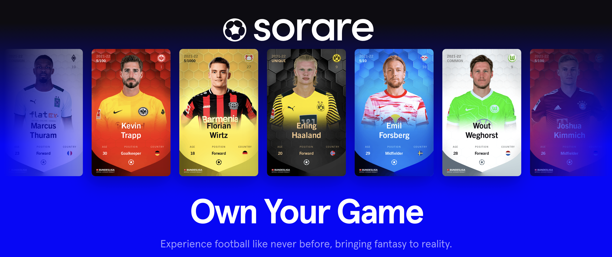

<p align="center">
  
</p>

# Sorare API

At Sorare, we are committed to providing an open platform for developers to build upon.

While our Cards are stored on the Ethereum blockchain (or within a [Starkware rollup](https://starkware.co/starkex/)) we support an API that provides more detailed information.

The Sorare API is provided by [GraphQL](https://graphql.org/). Documentation can be found under the Docs section in the [GraphQL playground](https://api.sorare.com/graphql/playground).

You can easily download the GraphQL schema using `[@apollo/rover](https://www.apollographql.com/docs/rover/)`:

```bash
$ npx -p @apollo/rover rover graph introspect https://api.sorare.com/graphql > schema.graphql
```

## User Authentication

### Pre-requisites

To authenticate yourself programmatically through our GraphQL API you'll need:

- your email
- the **hashed version** of your password

Your **password needs to be hashed** client-side using a salt. The salt can be retrieved with a HTTP GET request against our `https://api.sorare.com/api/v1/users/<youremail>` endpoint:

**Example:**

```bash
$ curl https://api.sorare.com/api/v1/users/myemail@mydomain.com

{"salt":"$2a$11$SSOPxn8VSUP90llNuVn.nO"}
```

The hashed password must be computed with _bcrypt_:

**Example in JavaScript:**

```javascript
import bcrypt from "bcryptjs";

const hashedPassword = bcrypt.hashSync(password, salt);
```

**Example in Ruby:**

```ruby
require "bcrypt"

hashed_password = BCrypt::Engine.hash_secret(password, salt)
```

Please also make sure to set the `content-type` HTTP header to `application/json`.

### GraphQL `signIn` mutation

For short and long-lived authentication, you should request a [JWT token](https://jwt.io/).

We provide JWT tokens within the `signIn` mutation. They can be retrieve using the following mutation:

```gql
mutation SignInMutation($input: signInInput!) {
  signIn(input: $input) {
    currentUser {
      slug
      jwtToken(aud: "<YourAud>") {
        token
        expiredAt
      }
    }
    errors {
      message
    }
  }
}
```

It expects the following variables:

```json
{
  "input": {
    "email": "your-email",
    "password": "your-hashed-password"
  }
}
```

`<YourAud>` is a mandatory _string_ parameter that identifies the recipients that the JWT is intended for. Your can read more about "aud" (Audience) [here](https://datatracker.ietf.org/doc/html/rfc7519.html#section-4.1.3). We recommend to use an `aud` reflecting the name of your app - like `myappname` - to make it easier to debug & track.

```bash
$ curl 'https://api.sorare.com/graphql' \
-H 'content-type: application/json' \
-d '{
  "operationName": "SignInMutation",
  "variables": { "input": { "email": "<YourEmail>", "password": "<YourHashPassword>" } },
  "query": "mutation SignInMutation($input: signInInput!) { signIn(input: $input) { currentUser { slug jwtToken(aud: \"<YourAud>\") { token expiredAt } } errors { message } } }"
}'

{"data":{"signIn":{"currentUser":{"slug":"<YourSlug>","jwtToken":{"token":"<YourJWTToken>","expiredAt":"..."}},"errors":[]}}}
```

You shall then pass the token with an `Authorization` header alongside a `JWT-AUD` header to all next API requests:

```bash
$ curl 'https://api.sorare.com/graphql' \
-H 'content-type: application/json' \
-H 'Authorization: Bearer <YourJWTToken>' \
-H 'JWT-AUD: <YourAud>' \
-d '{
    "operationName": "CurrentUserQuery",
    "query": "query CurrentUserQuery { currentUser { slug email } }"
}'

{"data":{"currentUser":{"slug":"<YourSlug>","email":"<YourEmail>"}}}
```

### Errors

Please refer to the `errors` field to understand why a `signIn` mutation failed.

If `currentUser` is `null` and you don't have any `errors`, it's because the user has 2FA setup. Please follow the next section to handle 2FA signins.

### 2FA

For account with 2FA enabled the `signIn` mutation will set the `otpSessionChallenge` field instead of the `currentUser` one.

```gql
mutation SignInMutation($input: signInInput!) {
  signIn(input: $input) {
    currentUser {
      slug
      jwtToken(aud: "<YourAud>") {
        token
        expiredAt
      }
    }
    otpSessionChallenge
    errors {
      message
    }
  }
}
```

**Example:**

```bash
$ curl 'https://api.sorare.com/graphql' \
-H 'content-type: application/json' \
-d '{
  "operationName": "SignInMutation",
  "variables": { "input": { "email": "<YourEmail>", "password": "<YourHashPassword>" } },
  "query": "mutation SignInMutation($input: signInInput!) { signIn(input: $input) { currentUser { slug jwtToken(aud: \"<YourAud>\") { token expiredAt } } otpSessionChallenge errors { message } } }"
}'

{"data":{"signIn":{"currentUser":null,"otpSessionChallenge":"3a390a0661cd6f4944205f68c13fd04f","errors":[]}}}
```

In this case, you will need to make another call to the `signIn` mutation and provide the `otpSessionChallenge` value you received and a one-time token from your 2FA device as `otpAttempt`:

```json
{
  "input": {
    "otpSessionChallenge": "eca010be19a80de5c134c324af24c36f",
    "otpAttempt": "788143"
  }
}
```

**Example:**

```bash
$ curl 'https://api.sorare.com/graphql' \
-H 'content-type: application/json' \
-d '{
  "operationName": "SignInMutation",
  "variables": { "input": { "otpSessionChallenge": "<YourOTPSessionChallenge>", "otpAttempt": "<YourOTPAttemp>" } },
  "query": "mutation SignInMutation($input: signInInput!) { signIn(input: $input) { currentUser { slug jwtToken(aud: \"<YourAud>\") { token expiredAt } } errors { message } } }"
}'

{"data":{"signIn":{"currentUser":{"slug":"<YourSlug>","jwtToken":{"token":"<YourJWTToken>","expiredAt":"..."}},"errors":[]}}}
```

## OAuth Authentication / Login with Sorare

With our [OAuth](https://oauth.net/2/) API, users can sign-in to your service using their Sorare account, which allows you to request data on their behalf.

In order to use our OAuth API, we will need to issue you a Client ID and Secret for your application. You can request one through our [Help Center](https://help.sorare.com/hc/en-us/requests/new) with the following information:

- A unique name for your application
- One or more callback URLs (e.g., `http://localhost:3000/auth/sorare/callback` for development & `https://myapp.com/auth/sorare/callback` for production)
- A logo for your application in PNG format

### OAuth Credentials

Once we validate your application, you will be provided with:

- OAuth Client ID
- OAuth Secret (keep this secret!)

### OAuth Scopes

All OAuth applications are provided with one scope which allows access to the following:

- Basic user information, including their nickname, avatar, and wallet address
- User's cards, achievements and favorites
- User's auctions, offers and notifications

The following are not accessible:

- Email addresses
- Future lineups and rewards
- Claiming rewards
- Bidding, selling, or making offers cards
- Accepting offers or initiating withdrawals

### Access & Refresh Tokens

First you need to create a "Login with Sorare" link in your app and use the following `href`:

```
https://sorare.com/oauth/authorize?client_id=<YourUID>&redirect_uri=<YourURLEncodedCallbackURI>&response_type=code&scope=
```

Once signed in to Sorare, the user will be asked to authorize your app and will ultimately be redirected to your `redirect_uri` with a `?code=` query parameter, for instance `https://myapp.com/auth/sorare/callback?code=<YourCode>`.

To request an OAuth access token you can then call the `https://api.sorare.com/oauth/token` endpoint with the following parameters:

- `client_id=<YourOAuthUID>`
- `client_secret=<YourOAuthSecret>`
- `code=<TheRetrievedCode>`
- `grant_type=authorization_code`
- `redirect_uri=<TheSameCallbackURIAsBefore>`

**Example:**

```bash
$ curl -X POST "https://api.sorare.com/oauth/token" \
-H 'content-type: application/x-www-form-urlencoded' \
-d 'client_id=<YourOAuthUID>&client_secret=<YourOAuthSecret>&code=<TheRetrievedCode>&grant_type=authorization_code&redirect_uri=<TheSameCallbackURIAsBefore>'

{"access_token":"....","token_type":"Bearer","expires_in":7200,"refresh_token":"...","scope":"public","created_at":1639608238}
```

You can then use the `access_token` the same way you would use a JWT token:

```bash
curl 'https://api.sorare.com/graphql' \
-H 'content-type: application/json' \
-H 'Authorization: Bearer <TheUserAccessToken>' \
-d '{
    "operationName": "CurrentUserQuery",
    "query": "query CurrentUserQuery { currentUser { slug } }"
}'

{"data":{"currentUser":{"slug":"<ASlug>"}}}
```

## Rate limit

The GraphQL API is rate limited. We can provide an extra API Key on demand that raises those limits.

Here are the configured limits:

- Unauthenticated API calls: 20 calls per minute
- Authenticated (JWT or OAuth) API calls: 60 calls per minute
- API Key API calls: 300 calls per minute

The API key should be passed in an http `APIKEY` header.

**Example:**

```bash
curl 'https://api.sorare.com/graphql' \
-H 'content-type: application/json' \
-H 'APIKEY: <YourPrivateAPIKey>' \
-H 'Authorization: Bearer <TheUserAccessToken>' \
-d '{
    "operationName": "CurrentUserQuery",
    "query": "query CurrentUserQuery { currentUser { slug } }"
}'
```

Whenever you perform too many requests, the GraphQL API will answer with a `429` HTTP error code and add a `Retry-After: <TimeToWaitInSeconds>` header (see [RFC](https://datatracker.ietf.org/doc/html/rfc6585#section-4)) to the response so your code can rely on it to understand how long it should wait before retrying.

## CORS

Our GraphQL API cannot be called from the browser on another domain than the ones we support. Therefore, it's expected to get a `Blocked by CORS policy [...]: The ‘Access-Control-Allow-Origin’ header has a value [...]` error.

Please consider calling the API from your backend servers.

## Pagination

A common use case in GraphQL is traversing the relationship between sets of objects. There are a number of different ways that these relationships can be exposed in GraphQL, giving a varying set of capabilities to the client developer.

Read more about GraphQL pagination on their [official documentation](https://graphql.org/learn/pagination/).

At Sorare, we use both [plural types](https://graphql.org/learn/pagination/#plurals) for connections with a limited cardinality and [cursor-based pagination](https://graphql.org/learn/pagination/#pagination-and-edges) for the others.

A working JavaScript code sample demonstrating how to leverage the `cursor` to iterate on all cards of a single user is available in [examples/allCardsFromUser.js](./examples/allCardsFromUser.js).

## Examples

Every operation that involves card or ETH transfer must be signed with your Starkware _private key_. It can be exported from [sorare.com](https://www.sorare.com) using your wallet.

**Make sure to keep your Private Key secret**.


To sign with your Starkware _private key_ in JavaScript, we recommend using the JavaScript package [`@sorare/crypto`](https://github.com/sorare/crypto).

### Listing auctions

To list the latest auctions, you can use the following query:

```gql
query ListLast10EnglishAuctions {
  transferMarket {
    englishAuctions(last: 10) {
      nodes {
        slug
        currentPrice
        endDate
        bestBid {
          amount
          bidder {
            ... on User {
              nickname
            }
          }
        }
        minNextBid
        cards {
          slug
          name
          rarity
        }
      }
    }
  }
}
```

A working JavaScript code sample is available in [examples/listEnglishAuctions.js](./examples/listEnglishAuctions.js).

## Bidding on auction

To make a bid on an auction, you'll need multiple prerequisites:

- the GraphQL API needs to be called authenticated (see above how to get an Authorization `token`)
- your Starkware private key
- the `slug` of the auction you want to bid for
- the `amount` (in wei) you want to bid

Here are the few steps required to bid:

1. Retrieve your `starkKey` using the `currentUser` query:

   ```gql
   query CurentUserQuery {
     currentUser {
       starkKey
     }
   }
   ```

1. Get the `id` and `minNextBid` of the auction you want to bid for:

   ```gql
   query EnglishAuctionLimitOrder($auctionSlug: String!) {
     englishAuction(slug: $auctionSlug) {
       id
       minNextBid
     }
   }
   ```

1. Get the list of `LimitOrder` objects from the `limitOrders` field of the auction you want to bid for, with the amount you want to bid:

   ```gql
   query EnglishAuctionLimitOrder($auctionSlug: String!, $amount: String!) {
     englishAuction(slug: $auctionSlug) {
       limitOrders(amount: $amount) {
         vaultIdSell
         vaultIdBuy
         amountSell
         amountBuy
         tokenSell
         tokenBuy
         nonce
         expirationTimestamp
       }
     }
   }
   ```

1. Sign all `LimitOrder` objects and build the `bidInput` argument.

   ```js
   const starkSignatures = limitOrders.map((limitOrder) => ({
     data: JSON.stringify(signLimitOrder(privateKey, limitOrder)),
     nonce: limitOrder.nonce,
     expirationTimestamp: limitOrder.expirationTimestamp,
     starkKey,
   }));

   const bidInput = {
     starkSignatures,
     auctionId: englishAuctionId,
     amount: bidAmountInWei,
     clientMutationId: crypto.randomBytes(8).join(""),
   };
   ```

   Note that the `clientMutationId` is using a random ID.

1. Call the `bid` mutation:

   ```gql
   mutation Bid($input: bidInput!) {
     bid(input: $input) {
       bid {
         id
       }
       errors {
         message
       }
     }
   }
   ```

A working JavaScript code sample is available in [examples/bidAuctionWithEth.js](./examples/bidAuctionWithEth.js).

## Creating offers

To create a Direct, Single Sale or Single Buy offer, you'll need multiple prerequisites:

- the GraphQL API needs to be called authenticated (see above how to get an Authorization `token`)
- your Starkware private key
- the `slug` of the card you want to send (and/or the amount of ETH you want to send)
- the list of card slugs you want to receive in return (and/or the amount of ETH you want to receive)

Here are the few steps required to create an offer:

1. Retrieve your `starkKey` using the `currentUser` query:

   ```gql
   query CurentUserQuery {
     currentUser {
       starkKey
     }
   }
   ```

1. Build the `prepareOfferInput` argument:

   ```js
   const prepareOfferInput = {
     type: "SINGLE_SALE_OFFER",
     sendCardsSlugs: [aCardSlug],
     receiveCardsSlugs: [],
     sendWeiAmount: "0",
     receiveWeiAmount: aWeiAmountAsString,
     receiverSlug: null,
     clientMutationId: crypto.randomBytes(8).join(""),
   };
   ```

1. Get the list of `LimitOrder` objects from the `limitOrders` field of the `prepareOffer` mutation:

   ```gql
   mutation NewOfferLimitOrders($input: prepareOfferInput!) {
     prepareOffer(input: $input) {
       limitOrders {
         amountBuy
         amountSell
         expirationTimestamp
         nonce
         tokenBuy
         tokenSell
         vaultIdBuy
         vaultIdSell
       }
       errors {
         message
       }
     }
   }
   ```

1. Sign all `LimitOrder` objects and build the `createSingleSaleOfferInput` argument.

   ```js
   const starkSignatures = limitOrders.map((limitOrder) => ({
     data: JSON.stringify(signLimitOrder(privateKey, limitOrder)),
     nonce: limitOrder.nonce,
     expirationTimestamp: limitOrder.expirationTimestamp,
     starkKey,
   }));

   const createSingleSaleOfferInput = {
     starkSignatures,
     dealId: crypto.randomBytes(8).join(""),
     cardSlug: aCardSlug,
     price: aWeiAmountAsString,
     clientMutationId: crypto.randomBytes(8).join(""),
   };
   ```

   Note that the `clientMutationId` and `dealId` are using random IDs.

1. Call the `createSingleSaleOffer` (or `createDirectOffer` or `createSingleBuyOffer`) mutation:

   ```gql
   mutation CreateSingleSaleOffer($input: createSingleSaleOfferInput!) {
     createSingleSaleOffer(input: $input) {
       offer {
         id
       }
       errors {
         message
       }
     }
   }
   ```

A working JavaScript code sample is available in [examples/createSingleSaleOffer.js](./examples/createSingleSaleOffer.js).

## Accepting offers

To accept a Direct, Single Sale or Single Buy offer, you'll need multiple prerequisites:

- the GraphQL API needs to be called authenticated (see above how to get an Authorization `token`)
- your Starkware private key
- the `id` of the offer you want to accept

Here are the few steps required to create an offer:

1. Retrieve your `starkKey` using the `currentUser` query:

   ```gql
   query CurentUserQuery {
     currentUser {
       starkKey
     }
   }
   ```

1. Get the `blockchainId` and the `receiverLimitOffers` of the Offer:

   ```gql
   query GetLimitOrders($id: String!) {
     transferMarket {
       offer(id: $id) {
         blockchainId
         receiverLimitOrders {
           amountBuy
           amountSell
           expirationTimestamp
           id
           nonce
           tokenBuy
           tokenSell
           vaultIdBuy
           vaultIdSell
         }
       }
     }
   }
   ```

1. Sign all `LimitOrder` objects and build the `acceptOfferInput` argument.

   ```js
   const starkSignatures = limitOrders.map((limitOrder) => ({
     data: JSON.stringify(signLimitOrder(privateKey, limitOrder)),
     nonce: limitOrder.nonce,
     expirationTimestamp: limitOrder.expirationTimestamp,
     starkKey,
   }));

   const acceptOfferInput = {
     starkSignatures,
     blockchainId: offer["blockchainId"],
     clientMutationId: crypto.randomBytes(8).join(""),
   };
   ```

   Note that the `clientMutationId` is using a random ID.

1. Call the `acceptOffer` mutation:

   ```gql
   mutation AcceptSingleSaleOffer($input: acceptOfferInput!) {
     acceptOffer(input: $input) {
       offer {
         id
       }
       errors {
         message
       }
     }
   }
   ```

A working JavaScript code sample is available in [examples/acceptSingleSaleOffer.js](./examples/acceptSingleSaleOffer.js).

## Subscribing to GraphQL events

The Sorare API provides different GraphQL events to subscribe to:

- `aCardWasUpdated`: triggers every time a card is updated
- `bundledAuctionWasUpdated`: triggers every time a (bundled) english auction is updated
- `currentUserWasUpdated`: triggers every time the current-user is updated (onyl works if authenticated)
- `gameWasUpdated`: triggers every time a game is updated
- `offerWasUpdated`: triggers every time an offer is updated
- `packWasSold`: triggers every time a pack is sold

The websocket URL to use is `wss://ws.sorare.com/cable`.

Sorare's GraphQL subscriptions are implemented through websockets with the `actioncable-v1-json` sub-protocol. Sorare relies on [ActionCable](https://guides.rubyonrails.org/action_cable_overview.html) because the [sorare.com](https://sorare.com) website has been scaled on a Ruby on Rails stack.

In order to ease the websocket + `actioncable-v1-json` sub-protocoal usage outside of a Ruby on Rails environment, you can use the TypeScript/JavaScript package [`@sorare/actioncable`](https://github.com/sorare/actioncable):

```bash
$ yarn add @sorare/actioncable
```

```js
const { ActionCable } = require("@sorare/actioncable");

const cable = new ActionCable({
  headers: {
    // 'Authorization': `Bearer <YourJWTorOAuthToken>`,
    // 'APIKEY': '<YourOptionalAPIKey>'
  },
});

cable.subscribe("aCardWasUpdated { id }", {
  connected() {
    console.log("connected");
  },

  disconnected(error) {
    console.log("disconnected", error);
  },

  rejected(error) {
    console.log("rejected", error);
  },

  received(data) {
    const aCardWasUpdated = data?.result?.data?.aCardWasUpdated;
    if (!aCardWasUpdated) {
      return;
    }
    const { id } = aCardWasUpdated;
    console.log("a card was updated", id);
  },
});
```

A working JavaScript code sample is available in [examples/subscribeAllCardUpdates.js](./examples/subscribeAllCardUpdates.js).
